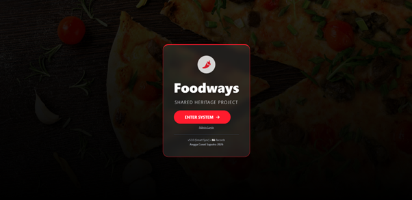
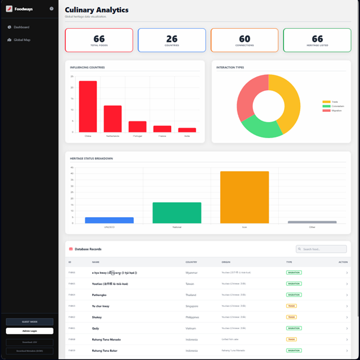
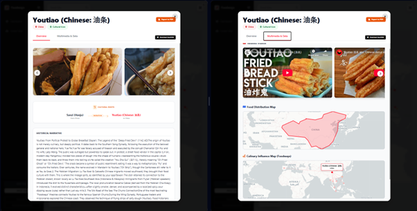
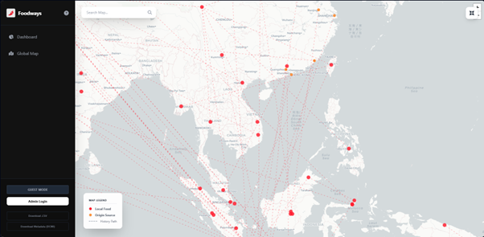

# FOODWAYS - Shared Heritage by Taste

> **Open Source Tools for Community & Governance Reform**
> *Built by Angga Conni Saputra*

---

## 🇬🇧 About This Project

Foodways is a Single Page Application (SPA) web tool designed to map, inventory, and analyze global culinary heritage. This project visualizes the historical journey of food through trade routes, migration, and colonialism.

The application is built using HTML5, Tailwind CSS, and Vanilla JavaScript, with a serverless backend utilizing Google Sheets & Google Apps Script (GAS).

✨ Key Features

🗺️ Mapping & Visualization

Global Interactive Map: An interactive map powered by Leaflet.js that displays food locations and historical connection lines (origin to current location).

Historical Paths: Visualization of dashed lines connecting the Origin to the current location, color-coded based on the connection type (Trade, Migration, Colonialism).

Pulse Animation: Visual indicator for the currently selected food location.

📊 Analytical Dashboard

Real-time KPIs: Displays total foods, number of countries, historical connections, and UNESCO status.

Charts: Bar and doughnut charts (using Chart.js) to analyze influential countries, interaction types, and heritage status.

Data Table: A complete data table with search and pagination features.

🛠️ Data Management (CRUD)

Integrated Database: Uses Google Sheets as a database (via CSV publish) and Google Apps Script for Write/Edit/Delete operations.

Admin Mode: Admin login to add, edit, or delete data entries.

Geo Editor: Built-in polygon drawing feature to map specific food distribution areas.

📥 Advanced Export & Reporting

Export to PDF: Generates complete food profile reports with professional layouts, including snapshots of distribution and influence maps (using html2pdf & html2canvas).

GeoJSON Export: Download spatial data compatible with ArcGIS/QGIS.

DCMI Metadata: Export metadata in Dublin Core (JSON) format for digital library purposes.

CSV Download: Download the entire dataset in CSV format.

📱 Multimedia

Video Carousel: Integrated YouTube video player for each food entry.

Image Gallery: Responsive image viewer.

🚀 Technologies Used

Frontend: HTML5, CSS3, JavaScript (ES6+)

Styling: Tailwind CSS (CDN)

Mapping: Leaflet.js & CartoDB Tiles

Charts: Chart.js

Data Parsing: PapaParse

Export Tools: html2pdf.js, html2canvas

Icons: FontAwesome 6

Backend: Google Apps Script (GAS)

Database: Google Sheets

====

💡 Technical Philosophy: The "Anomaly"

Here is why this unorthodox architecture was chosen:

1. The "One-File Monolith"

In a modern web development world where apps are split into hundreds of files (React components, Node.js backends, etc.), this application places all logic (HTML, CSS, JS, Map Logic, PDF Engine) into a single index.html file.

The Benefit: Extreme portability. The app can run offline (partially), be shared via email, requires no complex build steps (npm/webpack), and is server-agnostic. It is a "Guerrilla App": small, agile, and effective.

2. The "Democratized" Database

Cultural Heritage projects often rely on expensive, complex databases like PostgreSQL/PostGIS or Arches. This app forces Google Sheets to behave like a sophisticated relational database.

The Benefit: It lowers the barrier to entry for non-technical contributors. The script performs client-side CSV parsing (PapaParse) and handles complex parent-child relational logic (for food history) entirely in the browser memory. It is a "low-tech" solution for a "high-tech" problem.

3. "Ghost Mapping" PDF Engine

Standard PDF exports with maps usually require dedicated print servers. This app uses a "Ghost Mapping" technique.

The Technique: The app creates a hidden HTML container (ghost-map-container), re-renders the specific map views off-screen, takes a high-resolution snapshot using html2canvas, and embeds it into the PDF generation pipeline.

The Benefit: High-fidelity reporting with zero server costs.

4. High Standards on a Simple Stack

While the technology stack is simple, the output adheres to strict academic standards.

The Paradox: The "engine" is a simple HTML file, but it outputs DCMI (Dublin Core) metadata for digital libraries and GeoJSON for professional GIS software (ArcGIS/QGIS). It bridges the gap between hobbyist tools and professional requirements.

5. Digital Sustainability

Database projects often suffer from "Digital Rot"—sophisticated projects die after a few years when funding for servers or programmers runs out.

The Benefit: This application is "immortal." As long as GitHub and Google Sheets exist, this application will run for $0 forever. It requires zero server maintenance, making it highly attractive for sustainable heritage initiatives.

====

📂 Project Structure

Since this is a single-file application, all logic resides within index.html. However, the code is logically divided into:

State Management: Global state object to store data, filters, and auth status.

UI Controller: Handles modals, tab switching, and animations.

Map Logic: Leaflet initialization, layer rendering, and map interactions.

Dashboard Logic: Chart and table rendering.

App Controller: Handles CRUD, connections to Google Apps Script, and initial setup.

⚙️ Usage (Installation)

Since this app runs on the client-side, you don't need to install Node.js or set up a complex local server.

Run
Simply open the index.html file using a modern browser (Chrome, Edge, Firefox).

Optional: Use the "Live Server" extension in VS Code for the best experience.

🔧 Backend Configuration (Google Sheets)

This application connects to Google Sheets. If you want to use your own database:

Create a Google Sheet with the following column headers:
id, food_name, country, lat, lng, description, geometry_json, unesco_status, research_links, image_url, youtube_url, origin_food_name, origin_country, origin_lat, origin_lng, connection_type

Create a new Google Apps Script attached to that sheet to handle doGet and doPost (for Login & CRUD features).

Publish the Sheet as CSV (File > Share > Publish to web > CSV).

Update the variables inside index.html:

const GAS_URL = 'YOUR_GOOGLE_APPS_SCRIPT_URL';
const CSV_URL = 'YOUR_GOOGLE_SHEET_CSV_URL';

📸 Screenshots

Landing Page

  

Dashboard

  

Data Detail

  

Interactive Map

  

🤝 Contribution

Contributions are always welcome! Please create a Pull Request or open an Issue for improvement suggestions.

Fork this project.

Create your feature branch (git checkout -b feature-cool).

Commit your changes (git commit -m 'Add some cool feature').

Push to the branch (git push origin feature-cool).

Open a Pull Request.
 

---

## 🛡️ Security & Integrity (Why Open Source?) / Keamanan & Integritas

### 🇬🇧 Is it Safe? Yes.
There is a misconception that web apps might contain ransomware. **Here, you can verify it yourself.**
* **Auditable:** The code runs on the server (Google Apps Script/Web) or browser. You can inspect every `.gs`, `.html`, or `.js` file directly.
* **No Hidden Scripts:** There are NO `.exe` files or hidden encryption scripts. What you see is exactly what runs.
* **Safe to Use:** Designed to help, not to harm. Please check the source code before using.

### 🇮🇩 Apakah Aman? Ya, Sangat Aman.
Ada kesalahpahaman bahwa aplikasi web bisa berisi *ransomware*. **Di sini, Anda bisa membuktikannya sendiri.**
* **Bisa Diaudit:** Kode ini berjalan di server atau browser. Anda bisa melihat file `.gs`, `.html`, atau `.js` secara telanjang mata.
* **Tidak Ada Script Tersembunyi:** TIDAK ADA file `.exe` (aplikasi eksekusi) atau skrip enkripsi data (ransomware). Apa yang Anda lihat di kode, itulah yang dijalankan sistem.
* **Aman Digunakan:** Aplikasi ini dirancang untuk membantu, bukan merusak. Silakan bedah kodenya sebelum menggunakan.

---

## 🤝 Who Can Use This? / Siapa yang Boleh Pakai?

I dedicate this code for **Social Impact & Education**.
Saya mendedikasikan kode ini untuk **Dampak Sosial & Edukasi**.

✅ **PERMITTED / DIPERBOLEHKAN:**
* **Students/Researchers:** Free to clone/fork for learning, thesis, or research. *(Mahasiswa/Pelajar: Gratis untuk belajar/skripsi)*.
* **NGOs/Communities:** Free to use for community empowerment. *(LSM/Komunitas: Gratis untuk pemberdayaan masyarakat)*.
* **Public Sector:** Free to adopt for governance transparency. *(Pemerintah/Desa: Gratis untuk transparansi layanan)*.

❌ **PROHIBITED / DILARANG:**
* **Commercial Use:** Do NOT sell this software or use it for business profit without permission. *(Dilarang menjual atau mencari keuntungan bisnis dari kode ini tanpa izin)*.
* **Re-branding without Credit:** Please respect intellectual property. *(Mohon hargai karya intelektual dengan mencantumkan sumber)*.

> *"If you want to make money from this code, let's talk first. If you want to help people with this code, go ahead."*

---

## 📬 Contact / Kontak
For bug reports, feature requests, or commercial licensing inquiries: https://www.linkedin.com/in/anggaconni/ 
*(Untuk laporan bug, saran, atau izin komersial)*:

**Angga Conni Saputra**
*Governance Reform & Digital System Consultant*
(https://www.linkedin.com/in/anggaconni/)
